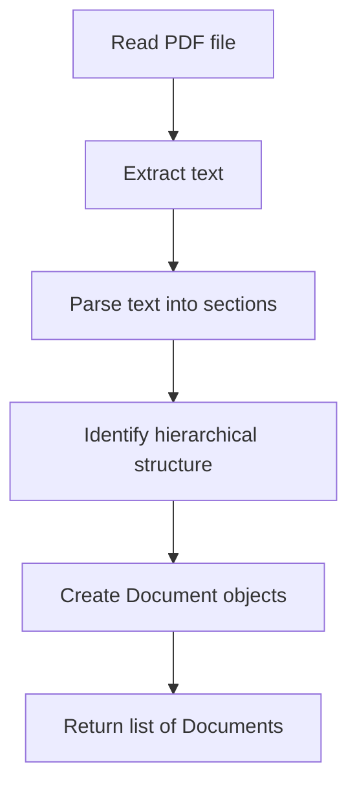
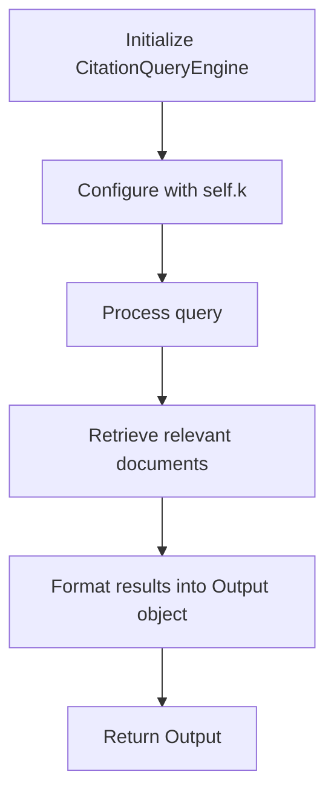
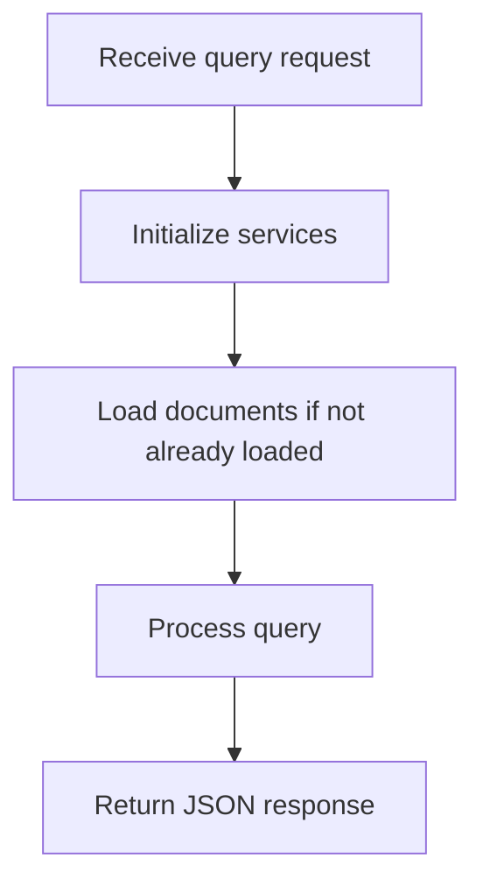
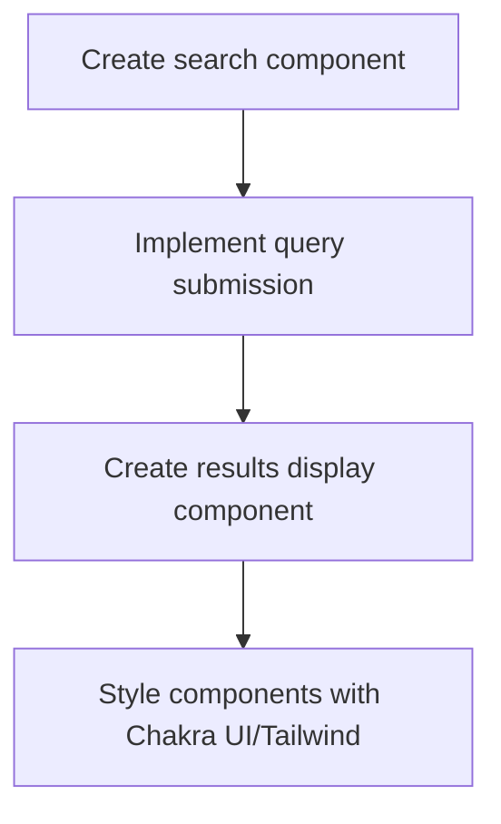
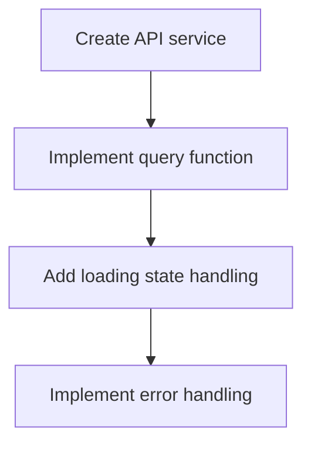
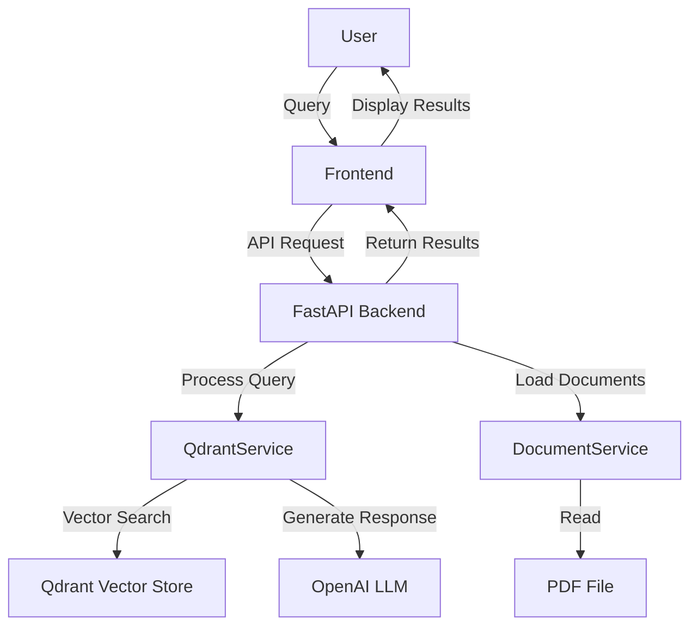

# Implementation Plan for Westeros Laws Query System

## 1. Backend Implementation

### 1.1 Update Dependencies
First, we need to update the requirements.txt file to include all necessary dependencies:
- FastAPI
- uvicorn
- PyPDF2 (for PDF processing)
- llama-index (latest 0.10.x version)
- qdrant-client
- openai
- python-multipart (for handling form data)

#### Subtasks:
1. **Package Upgrade Strategy**:
   - Check current imports in utils.py to identify all required packages
   - Research the latest compatible versions of each package
   - Update the imports in utils.py to match the new package structure
   - For llama-index specifically, migrate from older imports to the new namespace structure (e.g., from `llama_index` to `llama_index.core` or similar)
   - Test imports after updates to ensure compatibility

2. **Requirements File Update**:
   - Add specific version numbers for each package to ensure reproducibility
   - Include all dependencies and sub-dependencies
   - Add comments for critical packages explaining their purpose

### 1.2 Implement DocumentService
We'll implement the `create_documents()` method in the DocumentService class to:
- Use PyPDF2 to extract text from the PDF
- Parse the text to identify the hierarchical structure of laws
- Create Document objects with appropriate metadata and text content
- Structure the metadata to preserve the hierarchical numbering system

#### Subtasks:
1. **PDF Text Extraction**:
   - Initialize PyPDF2 PdfReader to read the PDF file
   - Extract text from each page
   - Combine text while preserving line breaks
   - Handle any encoding issues

2. **Text Parsing Logic**:
   - Implement regex patterns to identify section numbers (e.g., "1.", "1.1.", "1.1.1.")
   - Create a function to detect section titles (e.g., "Peace", "Religion")
   - Develop logic to associate text content with its corresponding section
   - Handle edge cases like citations or footnotes

3. **Hierarchical Structure Extraction**:
   - Create a tree-like data structure to represent the law hierarchy
   - Track parent-child relationships between sections
   - Maintain the full path for each law (e.g., "1. Peace > 1.1. The law requires...")
   - Handle indentation and formatting inconsistencies

4. **Document Object Creation**:
   - For each leaf node in the hierarchy, create a Document object
   - Include the full hierarchical path in the metadata
   - Store the section number and title in metadata
   - Include the complete text of the law in the Document's text field
   - Return a list of all created Document objects

### 1.3 Implement QdrantService Query Method
We'll complete the `query()` method in the QdrantService class to:
- Initialize a CitationQueryEngine from llama-index
- Configure the query engine to use self.k for similarity search
- Process the query and retrieve relevant documents
- Format the results into an Output object with citations

#### Subtasks:
1. **CitationQueryEngine Setup**:
   - Import the necessary components from llama-index
   - Initialize the CitationQueryEngine with our vector index
   - Configure similarity_top_k parameter to use self.k
   - Set up any additional parameters like response_mode="tree_summarize"

2. **Query Processing**:
   - Implement error handling for empty or invalid queries
   - Process the query through the query engine
   - Extract the response text from the query result

3. **Citation Extraction**:
   - Extract source nodes/documents from the query result
   - For each source, create a Citation object
   - Include the section identifier as the source
   - Include the relevant text snippet in the citation
   - Handle any formatting or truncation needed for citations

4. **Output Formatting**:
   - Create an Output object with the original query
   - Include the generated response text
   - Add the list of Citation objects
   - Ensure all fields are properly formatted for JSON serialization

### 1.4 Create FastAPI Endpoint
We'll implement the FastAPI endpoint in main.py to:
- Accept a query string as input
- Initialize the DocumentService and QdrantService
- Process the query and return the results as JSON
- Include proper error handling and documentation

#### Subtasks:
1. **Endpoint Definition**:
   - Create a POST endpoint at /query
   - Define request and response models
   - Add OpenAPI documentation

2. **Service Initialization**:
   - Initialize DocumentService and QdrantService as global variables or using dependency injection
   - Load documents only once at startup
   - Connect to Qdrant and initialize the index

3. **Query Processing**:
   - Extract the query string from the request
   - Pass the query to the QdrantService
   - Return the Output object as JSON
   - Add proper error handling

4. **API Documentation**:
   - Add detailed descriptions for the endpoint
   - Document request and response formats
   - Include example queries and responses

### 1.5 Update Dockerfile
We'll ensure the Dockerfile is properly configured to:
- Use the correct Python version
- Install all dependencies
- Set up the environment variables
- Expose the correct port
- Run the FastAPI application with uvicorn

#### Subtasks:
1. **Base Image Selection**:
   - Choose appropriate Python base image
   - Consider using slim variants for smaller image size

2. **Dependency Installation**:
   - Copy requirements.txt first for better caching
   - Install all dependencies in one RUN command
   - Clean up any cache to reduce image size

3. **Application Setup**:
   - Copy application code
   - Set working directory
   - Configure environment variables

4. **Runtime Configuration**:
   - Expose the correct port
   - Set up the entrypoint command
   - Configure uvicorn with appropriate settings

## 2. Frontend Implementation

### 2.1 Create Search Interface
We'll update the frontend to include:
- A search input field
- A submit button
- A results display area showing:
  - The original query
  - The AI-generated response
  - Citations from the laws

### 2.2 Implement API Integration
We'll create a service to:
- Connect to the backend API
- Send queries to the endpoint
- Process and display the responses
- Handle loading states and errors

### 2.3 Update Page Layout
We'll modify the existing page.tsx to:
- Integrate the search component
- Display the results
- Maintain the existing header and navigation

## 3. Testing and Documentation

### 3.1 Test Backend
- Test PDF processing
- Test query functionality
- Test API endpoints

### 3.2 Test Frontend
- Test search functionality
- Test API integration
- Test UI responsiveness

### 3.3 Update README.md
- Document setup instructions
- Include how to run the application
- Explain how to use the API
- Document any assumptions or design choices

## 4. Deployment

### 4.1 Docker Compose Setup
- Create a docker-compose.yml file to run both frontend and backend
- Configure networking between containers
- Set up volume mapping for persistent data

### 4.2 Environment Configuration
- Set up environment variables for production
- Configure API keys securely

## System Architecture Diagram

This plan outlines a comprehensive approach to implementing the required functionality. The system will allow users to query the laws of the Seven Kingdoms and receive relevant responses with citations to the specific laws.